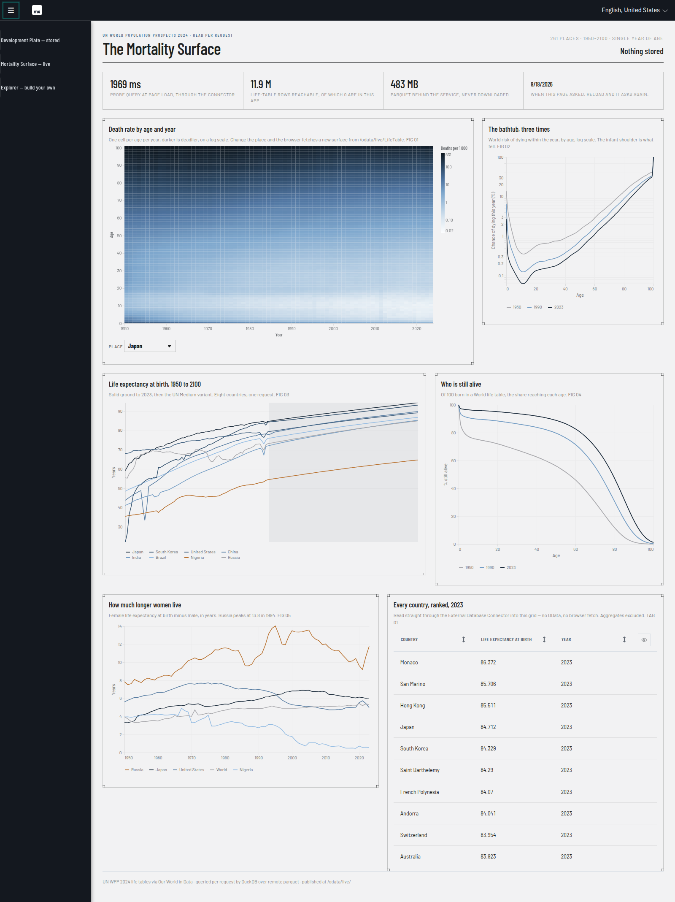
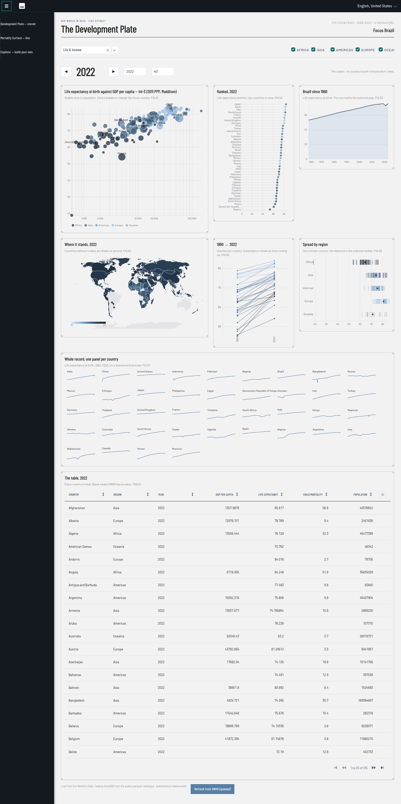
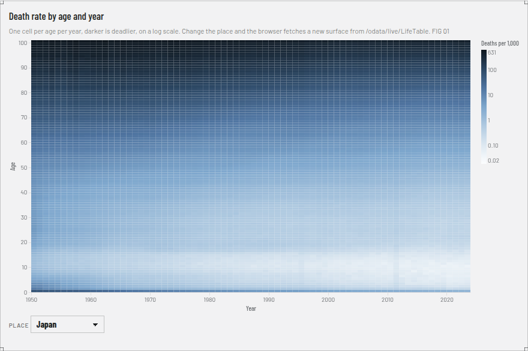
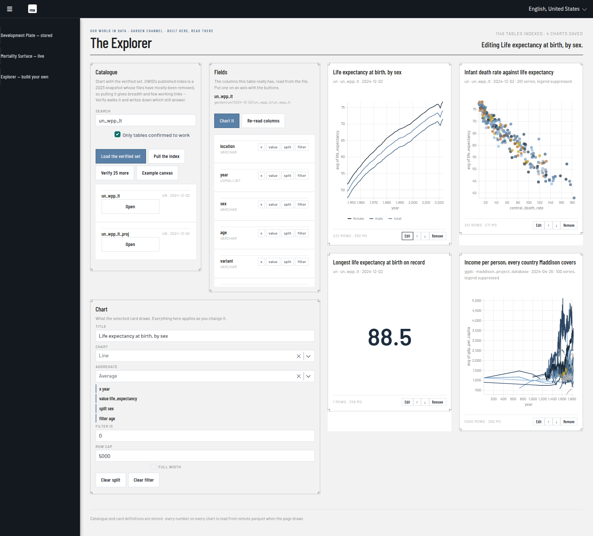
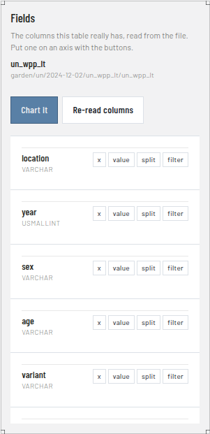
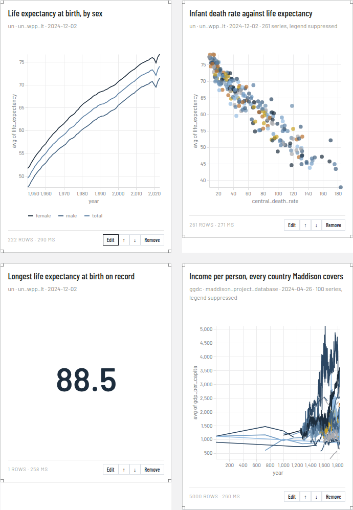

# OwidExplorer

Three dashboards over **Our World in Data**, built as a Mendix app with
[mxcli](https://github.com/ako/mxcli). They read the same public parquet
catalogue through the same DuckDB, and they answer the question *"where does
the data live"* three different ways — which is the whole point of having three.



## What this is for

The app is a working answer to a practical question: **when you put a Mendix
app in front of a data lake, how much of the lake do you copy?**

Mendix's instinct is to copy — import the data into entities, publish those,
draw the charts. That is board one, and it is fast and simple and stale the
moment the source moves. The alternative is to keep nothing and read per
request, which is board two, and it costs a second per figure and is never
stale. Board three asks whether the *charts themselves* have to be decided in
advance at all.

None of that is specific to Our World in Data. OWID is a good subject because
its whole catalogue is public parquet with no key and no rate limit, so every
claim here is measurable by anyone.

| | **Development Plate** | **Mortality Surface** | **Explorer** |
| --- | --- | --- | --- |
| | `/` | `/p/live` | `/p/explore` |
| Charts | fixed, authored | fixed, authored | chosen by whoever is looking |
| Data | copied into entities | none stored | none stored |
| Stored | 13,760 rows | nothing | the catalogue, and the card definitions |
| Path | job → entities → OData → charts | charts → OData → connector → DuckDB | canvas → connector → DuckDB |
| Freshness | as of the last refresh | as of this request | as of this request |
| Cost | one 16 s job, then instant | 0.3–1.4 s per figure | 0.3–1.9 s per card |
| Breaks when | the source moves | the source is slow | — |

---

## How it is built

### Everything is a script

There is no hand-drawn model. The app is **34 MDL scripts in `mdl/`**, applied
in numeric order, and they are the source of truth for 78 entities, 65
microflows, 19 pages, 13 Java actions, two OData services and a database
connection. Re-running a stage is how the model is changed.

That turned out to be worth more than tidiness. Adding one property to the
chart widget invalidated all twelve existing chart instances (`CE0463`), which
in Studio Pro is twelve right-clicks; here it was `mxcli exec mdl/13_page.mdl`.
Pages defined as scripts repair themselves.

It also has a trap, and it caught this project twice: `CREATE OR REPLACE` turns
*"this script is redundant"* into *"this script wins"*. Two stages that both
wrote the navigation profile meant re-running the earlier one silently reverted
the later one. One document, one owner — see `FINDINGS.md` #27.

### DuckDB, three ways in

DuckDB reads OWID's parquet over HTTP range requests, so no file is ever
downloaded whole. It is reached three ways, deliberately:

| | |
| --- | --- |
| **In-process, from Java** | `RefreshOwidData` opens `jdbc:duckdb:` inside the runtime and runs the nine-source harmonisation that fills board one. One statement, 13,760 rows out. |
| **External Database Connector** | Mendix's supported route, via the `BYOD` ("bring your own driver") type, which skips the driver-presence check DuckDB would fail. Boards two and three go through this. |
| **`DYNAMIC` SQL** | The connector's stored query is a stub declaring the row shape; the statement that runs is built per request and replaces it. Bound parameters still work, which is what keeps user input out of the SQL. |

The driver is a declared Java dependency (`org.duckdb:duckdb_jdbc:1.4.1.0`),
resolved into `vendorlib/` and committed, so a fresh clone compiles.

### Publishing data Mendix has no table for

Boards two and three publish non-persistable entities backed by read
microflows. The thing the documentation does not say is that **Mendix then
applies none of the query options to your answer** — `$filter`, `$orderby`,
`$top`, `$skip` and the key lookup all arrive on the URI and all stay there.
That is not an error; it is a 200 with the wrong rows.

The `mendix-odata-pushdown` skill pack does the translation, and the read
microflows are its splice-style caller: parse the URI once, concatenate the
fragments onto a base statement held in a constant, run it through the
connector. Every option was then checked at the wire rather than by looking at
a widget — see the table in `FINDINGS.md` #28.

### Charts

One pluggable widget renders both Vega-Lite and Vega, dispatching on the spec's
own `$schema`. Boards one and two hold authored specs; board three builds the
spec in a Java action from what the user picked, and hands it to the widget
through an attribute. Board two's mortality surface is full Vega rather than
Vega-Lite for one reason: its country selector is a signal and the data URL is
built from it, so changing the select re-issues the request.

### Look and feel

The **Industry** design system from the supplied mockup: steel blue `#5980a6` on
a light technical ground `#f2f2f3`, Barlow Condensed over Barlow, a modular
grid, and cards drawn as square-cornered hairline "blueprint" objects with `+`
registration marks. Built on mxcli's `signal` theme with its tokens retuned.

Fonts and the topojson are vendored under `theme/web/vendor/` — the app has no
CDN egress, and a chart that silently falls back to a system font is worse than
one that fails.

---

## Board one — "The Development Plate"



How 215 countries developed between 1960 and 2023 across nine indicators. Pick
a **topic** (which pair of indicators to plot), scrub a **year**, filter by
**region**, click any country to make it the **focus**; all seven figures read
that one shared state.

A Java action runs a single DuckDB query that harmonises nine OWID sources into
one country-year table and materialises 215 × 64 = 13,760 observations into
Mendix entities. Those are published at `/odata/owid/` and the figures fetch
from there. *Refresh from OWID* re-runs the extract on a task queue, so the app
serves throughout the 16 seconds it takes.

| Indicator | Source table |
| --- | --- |
| GDP per capita | `ggdc/2024-04-26/maddison_project_database` (ends 2022) |
| Population, life expectancy, child mortality, fertility, CO₂ | `worldbank_wdi/2026-07-27/wdi` |
| Primary energy per capita | `energy/2026-05-05/primary_energy_consumption` |
| Daily food supply | `faostat/2026-05-22/additional_variables` |
| Mean years of schooling | `education/2023-07-17/education_barro_lee_projections` |

The board opens on **2022**, the last year Maddison publishes GDP for.

---

## Board two — "The Mortality Surface"



The same design over a dataset the app **never copies**. UN World Population
Prospects 2024 life tables as OWID publishes them: 261 places, single year of
age by sex, estimates 1950–2023 and Medium-variant projections to 2100. 11.9
million rows and 483 MB of parquet, of which this app stores nothing.

```
browser --GET ?$filter=...&$top=...--> read microflow
        --> Owid.Parse (odata-pushdown) --> SQL fragments
        --> External Database Connector, DYNAMIC --> DuckDB
        --> catalog.ourworldindata.org over HTTP range requests
```

Five figures and a table: the Lexis surface above (74 years × 101 ages, with its
own country selector), the mortality bathtub, life expectancy 1950–2100
observed then projected, survival curves, and the female-minus-male gap — where
Russia peaks at 13.8 years in 1994. The table goes the other way on purpose:
same connection, same parquet, read straight into a Mendix data grid with no
HTTP and no OData, because publishing is a choice about the consumer rather than
a requirement of reading.

### What it costs

Cold is the first request after a restart; warm is any request after the
connector's pooled DuckDB connection has the file's metadata and pages cached.
Nothing in the app arranges that — it falls out of the connector holding the
handle.

| Request | Rows | Cold | Warm |
| --- | --- | --- | --- |
| `Places` (whole set) | 261 | 3.7 s | 0.46 s |
| `LifeTable`, one country, all ages and years | 7,474 | 1.4 s | 0.72 s |
| `LifeTable`, World, three years | 303 | — | 0.26 s |
| `LifeExpectancy`, 8 countries, 1950–2100 | 1,208 | — | 1.25 s |

The whole board is five parallel requests and about 1.5 s.

### Paging, and which kind it has

Two mechanisms, and only one is available on a read-microflow resource.

**Server-side paging** (`UsePaging` + `PageSize`, where Mendix chunks the answer
and returns `@odata.nextLink`) is refused by `CE7230` — correctly, since the
platform cannot chunk an answer it did not build, and `System.ODataResponse`
carries one field, `Count`, with nowhere to put a link.

**App-controlled paging** — `$top` and `$skip` — is fully available and is what
these resources implement. `$count` is what makes it usable, so they answer it
for real, only when asked:

```
GET /odata/live/LifeTable?$count=true   ->  500 rows of @odata.count 5852142
```

That last line is the point: without `$count`, an unbounded `GET` comes back
truncated at the default cap with nothing saying so.

---

## Board three — "The Explorer"



Not a dashboard someone built for you — a **chart builder**. Browse OWID's
catalogue, open a table to read the columns it really has, put a column on an
axis, keep the result on a canvas that survives a reload.

- **Catalogue** — the tables, searchable, filtered to the ones confirmed to be
  served.
- **Fields** — the selected table's real columns, read from the parquet footer
  when you open it. Each row carries `x` / `value` / `split` / `filter`. That is
  Tableau's drag-onto-a-shelf with the drag taken out — and it is not a style
  choice: an association combo box cannot be written from mxcli, because the
  required option caption is dropped and the build fails `CE0642`.

  

- **Chart** — the selected card's type (line, bar, area, scatter, heatmap,
  single number), aggregate, filter, row cap, width.
- **Canvas** — the saved cards, run live, reorderable.



**"Chart it" does not open an empty form.** It guesses from the columns the
table actually has — `year` on x if there is one, `country` / `location` /
`entity` as the split, the first numeric column not already spoken for as the
value, a line if x is a year and a bar otherwise. On OWID's garden channel that
lands on something sensible almost every time, because the whole channel is
harmonised to country × year.

### Stored and live, one layer further back

Stored is the catalogue index, each table's column list once looked at, and the
card *definitions* — which table, which columns, which chart type. Live is every
number on every chart: each card's query runs against remote parquet when the
page draws, and nothing comes back into the database.

A card's whole series arrives as **one JSON document built by DuckDB** —
`to_json(list(struct_pack(x := …, s := …, y := …)))` over the aggregate returns
exactly the array Vega wants — so no microflow ever loops five thousand rows to
concatenate a string.

The columns are chosen by the user but never typed by them: they are references
to `Owid.Field` rows that came from `DESCRIBE` on the file itself, so a card
cannot name a column that does not exist. The one value a person does type — the
filter — never reaches the statement at all; it is bound as `{filterval}`.

### The catalogue problem, stated plainly

OWID publishes its garden index twice, and only one of the two is current:

| | Last-Modified | DuckDB |
| --- | --- | --- |
| `catalog-garden.parquet` | **22 Mar 2023** | reads it in 0.6 s |
| `catalog-garden.feather` | today | cannot read it — LZ4 Arrow IPC |

The 2023 index is not slightly stale: **23 of 24 sampled paths 404**, rewriting
the version to `latest` rescues none of them, and
`garden/un/2024-12-02/un_wpp_lt` — which board two reads on every load — is not
in it at all. There is no bucket listing and no JSON index to fall back to.

So the browser runs on two sources, and says so. **Load the verified set** seeds
eleven paths checked by hand, so the page opens on tables that work. **Pull the
index** adds the 1,138 for breadth. **Verify 25 more** probes them in batches
and writes down which still answer, which is what makes the *"only tables
confirmed to work"* filter true rather than a guess. A probe asks HTTP for the
status before it asks DuckDB for the columns, because a missing file is the
ordinary outcome here and letting the query engine discover it turns the common
case into a stack trace (#42). **Example canvas** builds
the four cards above. `FINDINGS.md` #39 has the full account.

| | |
| --- | --- |
| Catalogue pull, 1,138 rows indexed | ~10 s, on the queue |
| Verify batch, 25 paths | 7.1 s |
| Column read on opening a table | ~0.5 s, one range request |
| First card on a cold table, 4,311 rows aggregated | 1.4–1.9 s |
| Same card after a change (warm connection) | 260–350 ms |

---

## Running it

```bash
./mxcli run --local -p OwidExplorer.mpr     # http://localhost:8080/
```

`/` is the stored board, `/p/live` the live one, `/p/explore` the builder; the
navigation menu carries all three.

A fresh clone has no `mxcli` binary (git-ignored, ~88 MB). The SessionStart hook
in `.claude/settings.json` runs `.claude/bootstrap-mxcli.sh`, which builds mxcli
from **ako/mxcli main** from source, caches MxBuild, starts PostgreSQL and
creates the database.

There is no security: no login, no user roles, anonymous access straight to the
boards, and the OData feeds are open. That is deliberate for a demonstrator and
would be the first thing to change for anything else.

### Rebuilding from the scripts

```bash
# the pushdown pack ships the parser the live read microflows delegate to
./mxcli skill add mendix-odata-pushdown -p OwidExplorer.mpr --module Owid
./mxcli exec .claude/skills/mendix-odata-pushdown/mdl/module.mdl -p OwidExplorer.mpr

for f in mdl/*.mdl; do ./mxcli exec "$f" -p OwidExplorer.mpr; done
~/.mxcli/mxbuild/*/modeler/mx check OwidExplorer.mpr
```

`01`–`18` build the stored board, `19`–`25` the live one, `26`–`34` the
explorer. If `vendorlib/` is ever incomplete, repair it with
`./mxcli sync-java-deps -p OwidExplorer.mpr`.

### Rebuilding the chart widget

The explorer needs the widget's `specSource` property (a model-built spec). If
the widget is rebuilt, **re-extract its definition** or mxcli will silently drop
every property it writes, and **re-apply the pages** or every existing instance
fails `CE0463`:

```bash
cd .claude/skills/mendix-vega-charts/widget && npm run build && cd -
cp .claude/skills/mendix-vega-charts/widget/dist/1.0.0/owidexplorer.widget.web.VegaChart.mpk widgets/
./mxcli widget extract --mpk widgets/owidexplorer.widget.web.VegaChart.mpk -p OwidExplorer.mpr
./mxcli exec mdl/13_page.mdl -p OwidExplorer.mpr
./mxcli exec mdl/23_livepage.mdl -p OwidExplorer.mpr
./mxcli exec mdl/32_explorepage.mdl -p OwidExplorer.mpr
./mxcli exec mdl/24_livenav.mdl -p OwidExplorer.mpr
```

### Reading it in Studio Pro

The module is foldered by architecture, because that is the thing worth seeing
first:

```
Board 1 - stored/    Load/  Dashboard/  Api/
Board 2 - live/      Resources/  Dashboard/
Board 3 - explorer/  Catalogue/  Shelf/  Canvas/
DuckDB/              the connection all three boards reach through
OData pushdown/      the skill pack's actions, kept apart because they are not
                     this app's code and are replaced wholesale on update
```

Entities are not in there — Mendix keeps them in the domain model rather than
the document tree. `mdl/25_folders.mdl` is the placement, so it survives a
rebuild from the scripts.

---

## What was learned

`FINDINGS.md` is the durable record — 40 entries, each with the measurement
behind it. The ones worth reading even if you never touch this app:

| | |
| --- | --- |
| #20 | The External Database Connector *does* work with DuckDB, via `BYOD`. Two traps build green and fail at run time. |
| #28–#31 | Publishing over data Mendix has no table for: what reaches the SQL, what silently does not, and the key lookup that returned the wrong row under a 200. |
| #32 | The UN scales three rate columns three different ways and says so nowhere. |
| #36–#38 | mxcli's edges: the widget definition cache, what a list expression can and cannot say, and the combo box that cannot be written. |
| #39 | OWID's catalogue index: the current one is unreadable and the readable one is three years stale. |

- Mendix **11.13.0**
- mxcli built from source, `ako/mxcli` main
